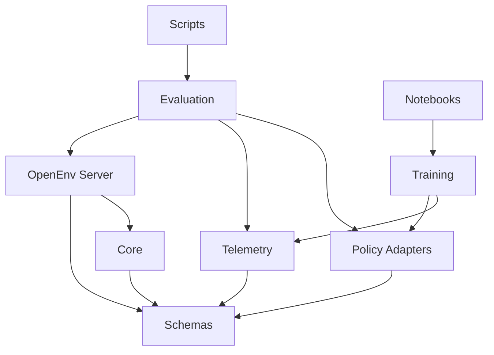

# Project File Structure

> Target layout for the Nation Optimizer RL environment. The project uses `uv`, TDD, centralized telemetry, and top-level Python packages.

---

## Root

```
nation-optimizer-rl/
├── README.md
├── FILE_STRUCTURE.md
├── pyproject.toml
├── uv.lock                         # generated by uv
├── Dockerfile
├── openenv.yaml
├── .gitignore
│
├── assets/
│   ├── poster.png
│   └── results/                    # committed plots for judging
│
├── specification/                  # authoritative game design docs
│
├── core/                           # pure game engine, no OpenEnv/HF deps
├── server/                         # OpenEnv + FastAPI integration
├── schemas/                        # shared Action/Observation/Reward models
├── agents/                         # swappable policy adapters
├── telemetry/                      # central JSONL logging and metrics
├── evaluation/                     # seeded comparisons and plots
├── training/                       # TRL/Unsloth scripts and rollout datasets
│
├── tests/
│   ├── unit/
│   ├── integration/
│   └── fixtures/
│
├── scripts/                        # thin CLI wrappers only
└── notebooks/                      # Colab-ready training notebooks
```

Top-level packages keep the repository easy to scan during the hackathon and match the existing `core/` directory the environment team is already using.

---

## Package Layout

### `core/`

Pure game mechanics. This layer owns rules and state transitions:

- phase progression
- proposal and voting resolution
- treasury updates
- event generation and event impacts
- revenue, productivity, population, reward, termination

It must not import OpenEnv, Hugging Face clients, or agent implementations.

### `server/`

OpenEnv adapter layer:

- `environment.py`: `MCPEnvironment`/`Environment` wrapper around core
- `models.py`: OpenEnv-facing request/response models
- `app.py`: FastAPI/Space entrypoint

This layer translates between OpenEnv APIs and shared schemas. It should stay thin.

### `schemas/`

Shared contracts used by core, server, agents, telemetry, evaluation, and tests:

- `actions.py`: `DEBATE`, `PROPOSE_BUDGET`, `VOTE`, `ABSTAIN_FROM_PROPOSAL`
- `observations.py`: public/private phase-specific observation data
- `rewards.py`: reward components and per-step reward info
- `metrics.py`: episode and benchmark metrics
- `phases.py`: phase enum and phase/action mapping
- `departments.py`: department identifiers and defaults

Schemas are the integration contract. Agents should depend on these, not server internals.

### `agents/`

Policy adapters that consume observations and emit structured actions:

```
agents/
├── base.py
├── action_parser.py
├── prompts.py
├── rule_based/
│   ├── greedy.py
│   ├── equal_split.py
│   ├── conservative.py
│   └── optimal_zone.py
├── llm/
│   ├── hf_client.py
│   ├── parliamentary.py
│   └── dictator.py
└── trained/
    └── trl_policy.py
```

Every adapter implements the same contract:

```python
adapter.act(observation, valid_actions, agent_id) -> Action
```

Adapters do not enforce game rules. They suggest actions; the environment validates and records outcomes.

### `telemetry/`

Central logging is a first-order feature:

- `events.py`: structured telemetry event types
- `episode_logger.py`: in-memory and file-backed episode logger
- `jsonl_writer.py`: append-only JSONL sink
- `metrics_collector.py`: episode and benchmark aggregation
- `plotter.py`: reward/loss/result plots for README and judging

Default artifact format is JSONL so rollouts can be inspected, plotted, or converted into training data.

### `evaluation/`

Benchmarking and comparison code:

- `run_episode.py`: run one seeded episode
- `benchmark_policies.py`: compare adapters on shared seeds
- `compare_adapters.py`: greedy vs equal split vs parliament vs dictator
- `seed_sweep.py`: reproducible multi-seed evaluation

### `training/`

Hackathon training artifacts:

- `build_rollout_dataset.py`: convert telemetry JSONL into supervised/preference data
- `train_trl.py`: minimal HF TRL training script
- `reward_curve.py`: plot training progress

Training code should be runnable locally with `uv` and portable to Colab/HF.

---

## Dependency Direction



Allowed dependency flow:

- `core` can depend on `schemas`.
- `server` can depend on `core` and `schemas`.
- `agents` can depend on `schemas` only, plus optional provider clients.
- `evaluation` coordinates `server`, `agents`, and `telemetry`.
- `training` consumes telemetry and trained-policy adapters.

Forbidden:

- agents importing core internals
- clients importing server internals
- core importing OpenEnv, FastAPI, TRL, or Hugging Face clients
- direct agent-agent communication outside environment observations

---

## TDD Checklist

Start each slice with tests:

- `tests/unit/test_action_schema.py`
- `tests/unit/test_observation_schema.py`
- `tests/unit/test_greedy_adapter.py`
- `tests/unit/test_equal_split_adapter.py`
- `tests/unit/test_episode_logger.py`
- `tests/integration/test_mock_env_episode.py`
- `tests/integration/test_openenv_contract.py`
- `tests/integration/test_policy_benchmark_smoke.py`

Standard commands:

```bash
uv sync
uv run pytest
uv run python -m evaluation.benchmark_policies
```

---

## Implementation Phases

1. Shared schemas and adapter interface.
2. Central telemetry with JSONL output.
3. Rule-based baselines against mock observations.
4. Mock phased environment contract for adapter development.
5. OpenEnv wrapper integration once core loop is ready.
6. LLM adapters with strict JSON actions and prompt/action logging.
7. Seeded baseline comparisons and committed plots.
8. TRL/Unsloth training script and Colab-ready notebook.
