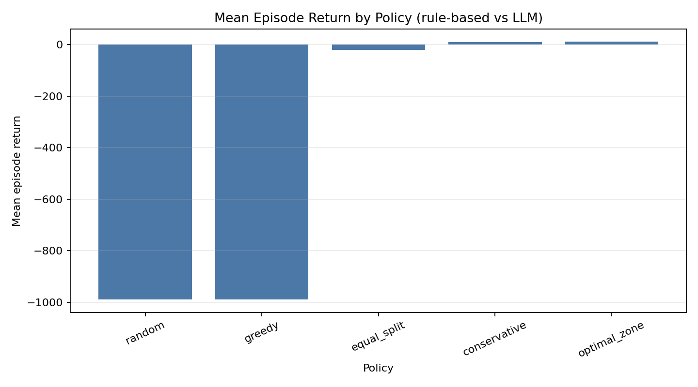
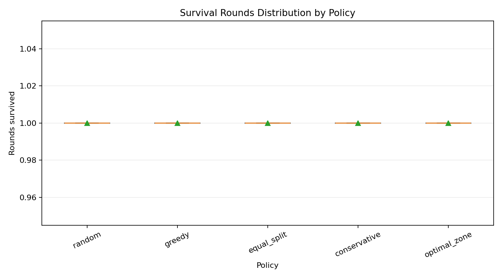
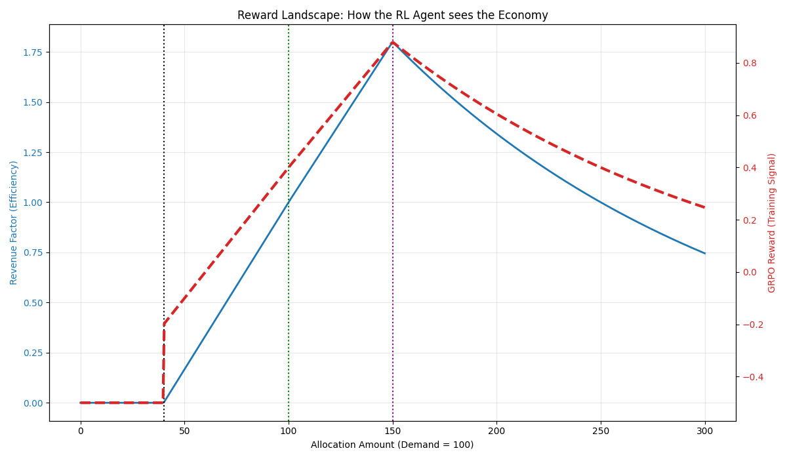

# Nation Optimizer RL

> A centralized planning environment where LLMs learn resource allocation through structured parliamentary reasoning. Inspired by the Marxist principle: *"From each according to his ability, to each according to his need."*

---

### 🔗 Submission Quick-Links
*   **🚀 Hugging Face Space**: [Nation Optimizer](https://huggingface.co/spaces/ascentftw/nation_optimizer)
*   **📓 Training Notebook**: [Open in Colab (training.ipynb)](https://colab.research.google.com/github/Kr0issant/communism-optimizer-rl/blob/main/training.ipynb)
*   **📊 Training Evidence**: [Reward & Loss Curves](assets/results/)
*   **📽️ Project Presentation**: [YouTube Video / Blog Post Placeholder](https://huggingface.co/blog/your-username/nation-optimizer)

---


## Overview

This project is a **centralized planning environment** where a single LLM learns resource allocation through structured parliamentary reasoning. The "ministers" are role-play personas—not independent learners—used to scaffold interpretable decision-making via debate and voting.

- **Architecture**: One underlying LLM called multiple times with different role prompts (parliamentary wrapper vs. direct dictator baseline)
- **Mechanism**: Sequential budget proposals with public voting rounds (interpretability through structured reasoning)
- **Reward**: Prosperity (GDP per capita) over long horizons (450 steps/episode)
- **Uncertainty**: Stochastic events with hidden costs force reasoning under partial observability
- **Constraint**: No debt allowed. Bankruptcy = episode failure.

## What This Model Captures

This is **NOT a multi-agent system**—it is single-agent planning with a parliamentary narrative wrapper. The same underlying LLM is called multiple times with different minister role prompts. The "parliament" serves as cognitive scaffolding: structured reasoning (debate + voting) that makes the model's allocation decisions interpretable.

Despite its simplifications, the simulation captures five core dynamics of resource allocation:

1. **Planning under uncertainty**
   > Can the model allocate limited resources when each department's true needs are hidden?

2. **Sequential reasoning**
   > How does proposal order affect outcomes? Does the first proposer capture the treasury?

3. **Long-horizon tradeoffs**
   > Can the model balance immediate needs against future crises over 450 steps?

4. **Forward-looking behavior**
   > Does the model save surplus for future crises, or spend everything now?

5. **Interpretability through structure**
   > Can parliamentary debate and voting traces explain allocation decisions?

## The Core Research Question

> **"Can structured reasoning (parliamentary debate + voting) improve long-horizon resource allocation compared to direct central planning?"**

This asks whether interpretable cognitive scaffolding (parliamentary reasoning traces) improves planning performance over opaque direct allocation, particularly under partial observability and sparse rewards.

In economics, this connects to:
- **Keynesian**: Counter-cyclical spending and demand management
- **Soviet Planning**: Centralized resource allocation challenges
- **Public Choice**: Institutional rules and voting dynamics
- **Neoclassical Growth**: Per-capita output and productivity
- **Information Economics**: Decision-making under uncertainty
- **Explainable AI**: Interpretability through structured reasoning traces
- **Marxist Distribution**: Collective benefit over individual gain

## Theoretical Assumptions

The simulation makes explicit assumptions from several economic and AI traditions:

| Tradition | Assumption | Our Implementation |
|-----------|-----------|-------------------|
| **Keynesian** | Spending drives growth | `Productivity = f(Investment)` where Investment = actual consumption |
| **Soviet Planning** | Centralized allocation | All resources flow through treasury; no private market |
| **Public Choice** | Voting determines budgets | Majority rule with rotating proposal order |
| **Neoclassical Growth** | Population affects per-capita output | `Prosperity = Output / Population` with exogenous growth |
| **Information Economics** | Uncertainty requires inference | Model observes severity + narrative, NOT exact cost |
| **Austrian/Black Swan** | Rare extreme events disrupt equilibrium | 40% normal rounds, 1% black swan crises |
| **Explainable AI** | Interpretability through structure | Parliamentary debate traces expose reasoning steps |
| **Marxist Distribution** | Collective reward | Single reward signal for all allocations |
| **Institutional Economics** | Rules shape behavior | Hard constraints (no debt, no self-voting, rotating order) |

## Specification

The complete game design is documented in the [`specification/`](specification/) folder:

| Document | Content |
|----------|---------|
| [`00_INDEX.md`](specification/00_INDEX.md) | Navigation and reading order |
| [`01_GAME_OVERVIEW.md`](specification/01_GAME_OVERVIEW.md) | Concept, inspiration, goals |
| [`02_GAME_RULES_REFERENCE.md`](specification/02_GAME_RULES_REFERENCE.md) | Single-page rules reference |
| [`03_TURN_STRUCTURE.md`](specification/03_TURN_STRUCTURE.md) | 9-phase turn flow |
| [`04_ECONOMY_MODEL.md`](specification/04_ECONOMY_MODEL.md) | Treasury, revenue, efficiency formulas |
| [`05_VOTING_PROTOCOL.md`](specification/05_VOTING_PROTOCOL.md) | Voting mechanics, tie-breaking, abstention |
| [`06_EVENT_SYSTEM.md`](specification/06_EVENT_SYSTEM.md) | Event catalog, severity, black swans |
| [`07_AGENT_ACTION_SPACE.md`](specification/07_AGENT_ACTION_SPACE.md) | Valid agent actions |
| [`08_OBSERVATION_SPACE.md`](specification/08_OBSERVATION_SPACE.md) | What agents observe |
| [`09_REWARD_MODEL.md`](specification/09_REWARD_MODEL.md) | Prosperity/GDP reward function |
| [`10_SUCCESS_CRITERIA.md`](specification/10_SUCCESS_CRITERIA.md) | Winning/losing conditions |
| [`11_GUARDRAILS.md`](specification/11_GUARDRAILS.md) | Explicit exclusions (mechanics vs hackathon deliverables) |
| [`12_GLOSSARY.md`](specification/12_GLOSSARY.md) | Defined terms |
| [`13_RL_ADAPTERS_AND_TRAINING.md`](specification/13_RL_ADAPTERS_AND_TRAINING.md) | Adapters, telemetry, evaluation, TRL/Unsloth pipeline |
| [`APPENDIX_A_EXAMPLES.md`](specification/APPENDIX_A_EXAMPLES.md) | Concrete numerical examples |

**Hackathon themes and judging (external minimum bar):** OpenEnv Apr ’26 themes, TRL/Unsloth requirement, Space, plots, and README expectations.

**Sprint plan (reconciled with the spec):** [`ImplemenationPlanRLIncluded.md`](ImplemenationPlanRLIncluded.md).

## Key Design Decisions

- **Model A: Government Budget Execution**: Treasury pays only for actual consumption, not full allocations. Unspent budget returns to treasury.
- **Rotating Proposal Order**: Departments rotate each round (`departments[t mod N]`) to prevent permanent first-mover advantage.
- **No Self-Voting**: Ministers must abstain from voting on their own proposal.
- **Investment-Driven Productivity**: Actual spending (consumption) boosts next round's productivity, not savings.
- **Revenue from Consumption**: Departments generate revenue from actual output, not budget size.
- **Population Growth**: Healthy population growth (0.5%/round) with health and crisis impacts.
- **Black Swan Distribution**: 40% normal rounds, rare crises (1% compound black swan events).
- **Government Shutdown**: If parliament fails to allocate any budget for 2 consecutive rounds, episode ends with governance collapse.

## v1 Department List

1. **Social/Municipal** — Baseline: 60
2. **Agriculture** — Baseline: 70
3. **Health** — Baseline: 90
4. **Education/R&D** — Baseline: 80
5. **Defense** — Baseline: 100
6. **Commerce** — Baseline: 75

## Getting Started

1.  **Clone and Install**:
    ```bash
    git clone https://github.com/Kr0issant/communism-optimizer-rl.git
    cd communism-optimizer-rl
    uv sync --extra dev --extra viz --extra training
    ```

2.  **Run Benchmarks**:
    Compare different parliamentary strategies (Greedy, Conservative, Optimal):
    ```bash
    uv run python scripts/benchmark_baselines.py --adapter conservative --episodes 5
    ```

3.  **Visualize Reward Landscape**:
    Verify how the RL reward function scores different budget allocations:
    ```bash
    uv run python scripts/benchmark_rewards.py
    ```

4.  **Test LLM Ministers**:
    Run a live inference test with a model from Hugging Face:
    ```bash
    # Ensure HF_TOKEN and HF_MODEL_ID are in your .env
    uv run python scripts/llm_test_run.py
    ```

## Development

This project uses `uv` and top-level Python packages (`core`, `agents`, `schemas`, `telemetry`, `evaluation`, `training`).

```bash
uv sync --extra dev
uv run pytest
```

The benchmark scripts provide a quick way to validate changes to the engine or reward functions. `scripts/benchmark_baselines.py` runs rule-based policies against shared seeds to track treasury and population survival. `scripts/benchmark_rewards.py` generates a visualization of the RL training signal in `assets/results/reward_landscape.png`.

### Run the Server / Space

The OpenEnv-compatible server wraps `core.game.NationGame` without changing game rules. It uses `openenv-core==0.2.3`, exposes the thin whole-game wrapper at `server.app:app`, and is configured for Hugging Face Space hosting through `openenv.yaml`.

```bash
uv sync --extra dev
uv run uvicorn server.app:app --host 0.0.0.0 --port 8000
```

For Docker or Space smoke tests:

```bash
docker build -t nation-optimizer-rl .
docker run --rm -p 8000:8000 nation-optimizer-rl
```

### LLM adapters

Both adapters use the **same underlying LLM**—the difference is in the prompt wrapper, not the model weights:

**`agents.llm.ParliamentaryLLMAdapter`**: Calls the model multiple times with different minister role prompts (Health, Defense, etc.), each generating debate messages, proposals, or votes. This creates an **interpretable reasoning path**—the parliamentary debate traces expose the model's allocation rationale.

**`agents.llm.DictatorLLMAdapter`**: Calls the same model with a single central-planner prompt that directly outputs allocations for all departments. This provides an **opaque baseline** for comparison—same model capacity, but without structured reasoning traces.

Both adapters parse structured JSON actions, validate against the action schema, and log `LLM_CALL` telemetry. The Dictator's `act_for_agents` shim calls the model one department at a time to preserve API compatibility, but this is an implementation detail—not independent agents.

Tests and CI should use mock `TextGenerationClient` implementations, so no network or `HF_TOKEN` is required. For live inference, install `huggingface_hub`, set `HF_TOKEN` and `HF_MODEL_ID`, and construct `HuggingFaceTextGenerationClient`. Training and fine-tuning are separate from these inference adapters and belong to Mega 4 under `training/`.

## Trained policy (GRPO)

The parliamentary minister adapter is fine-tuned with TRL's `GRPOTrainer` on top of `Qwen/Qwen2.5-0.5B-Instruct` using LoRA. Prompts are collected from `OptimalZoneAdapter` rollouts via [`scripts/collect_grpo_prompts.py`](scripts/collect_grpo_prompts.py) and use the live [`render_minister_prompt`](llm_integration/prompts/minister.py) template, so the same template drives both training and inference. Only Phase 3 (`PROPOSAL`) and Phase 4 (`VOTING`) turns receive reward updates — debate stays inference-only.

The reward function in [`training/reward_fn.py`](training/reward_fn.py) is dense and grounded in the engine's own piecewise revenue curve from [`core/revenue.py`](core/revenue.py): proposals are scored against their sector's `(critical, demand, surplus)` thresholds, votes are scored by the revenue factor of the proposed allocation, and parsing/legality failures are penalised explicitly.

- **Trained LoRA on the Hub:** [`nation-optimizer/nation-parliamentary-grpo-lora`](https://huggingface.co/nation-optimizer/nation-parliamentary-grpo-lora)
- **Prompt dataset:** [`nation-optimizer/nation-parliamentary-prompts`](https://huggingface.co/datasets/nation-optimizer/nation-parliamentary-prompts)
- **Trackio training curves:** [`nation-optimizer/grpo-parliamentary`](https://huggingface.co/spaces/nation-optimizer/grpo-parliamentary) (loss + mean reward per step)

### Reproduce the run

Collect prompts and push them to the Hub:

```bash
uv run python -m scripts.collect_grpo_prompts \
    --seeds 50 --max-rounds 12 \
    --output assets/datasets/grpo_prompts.jsonl \
    --push-to-hub nation-optimizer/nation-parliamentary-prompts
```

Train on Hugging Face Jobs (GRPO + LoRA, ~$5 on `a10g-small`):

```bash
hf jobs uv run --flavor a10g-small --secrets HF_TOKEN \
    training/train_grpo.py \
    --dataset-id nation-optimizer/nation-parliamentary-prompts \
    --hub-model-id nation-optimizer/nation-parliamentary-grpo-lora
```

Locally, the same script runs in `--smoke` mode (5 GRPO steps, batch 1, no Hub push) to prove the pipeline imports and the reward function scores real generations:

```bash
uv run --extra training python training/train_grpo.py --smoke \
    --dataset-id nation-optimizer/nation-parliamentary-prompts
```

### Before-vs-after evidence

The benchmark CLI runs the trained LoRA, the untrained base model, and the rule-based baselines against shared seeds.

| File | Content |
|------|---------|
| `policy_comparison.png` | Mean episode return per policy, with the trained LoRA highlighted |
| `survival_rounds.png` | Distribution of rounds survived per policy across all seeds |
| `reward_landscape.png` | Visualization of the RL training signal (Efficiency vs Reward) |
| `benchmark_summary.json` | Raw per-episode metrics for every policy |

#### Policy Performance



#### Reward Landscape


## Hackathon Theme Alignment

This project aligns with OpenEnv Hackathon themes as follows:

### Primary: Theme #2 — Long-Horizon Planning & Instruction Following
- **450 steps per episode**: Sparse rewards force the model to learn credit assignment over extended horizons
- **Budget constraints propagate**: Decisions in early rounds affect available resources 50+ steps later
- **No myopic shortcuts**: Immediate consumption vs. future crisis preparation requires genuine foresight

### Secondary: Theme #3.1 — World Modeling
- **Economic feedback loops**: Spending → productivity → revenue → future spending capacity
- **Hidden state inference**: Model must infer true event costs from severity signals and narrative
- **Cascading failure modes**: Health crises reduce population, which reduces productivity, which reduces revenue

### Not Theme #1 (Multi-Agent)
This is explicitly **not** a multi-agent system. There is one learner—the underlying LLM. The "parliament" is a structured reasoning scaffold, not independent agents with separate gradients.

## Hackathon Context

This project targets the **OpenEnv Hackathon** (India 2026) expectations (themes, judging weights, and **minimum submission** requirements). In short:

- **OpenEnv (latest):** build on the framework; use `Environment` / `MCPEnvironment`, Gym-style `reset` / `step` / `state`, client–server boundaries, and a valid **`openenv.yaml`** when the server is published.
- **Training:** a **working script** using **Hugging Face TRL** or **Unsloth** (ideally Colab-runnable) that trains **against the environment**, not only a static dataset, with **evidence** (loss and reward or clear before/after behavior, plots committed as e.g. PNG in-repo).
- **Storytelling:** mini-blog on Hugging Face or a YouTube video **under two minutes** (or short deck); link everything from this README; host the **Space** and submit the Space URL.
- **Judging (overview):** environment innovation, storytelling, **showing improvement in rewards** (curves, baselines), and **reward + training pipeline** coherence.

**Collective reward** and mechanics guardrails are unchanged; see [`11_GUARDRAILS.md`](specification/11_GUARDRAILS.md) for how **mechanics specs (01–12)** relate to these **deliverable** requirements.

## License

MIT
